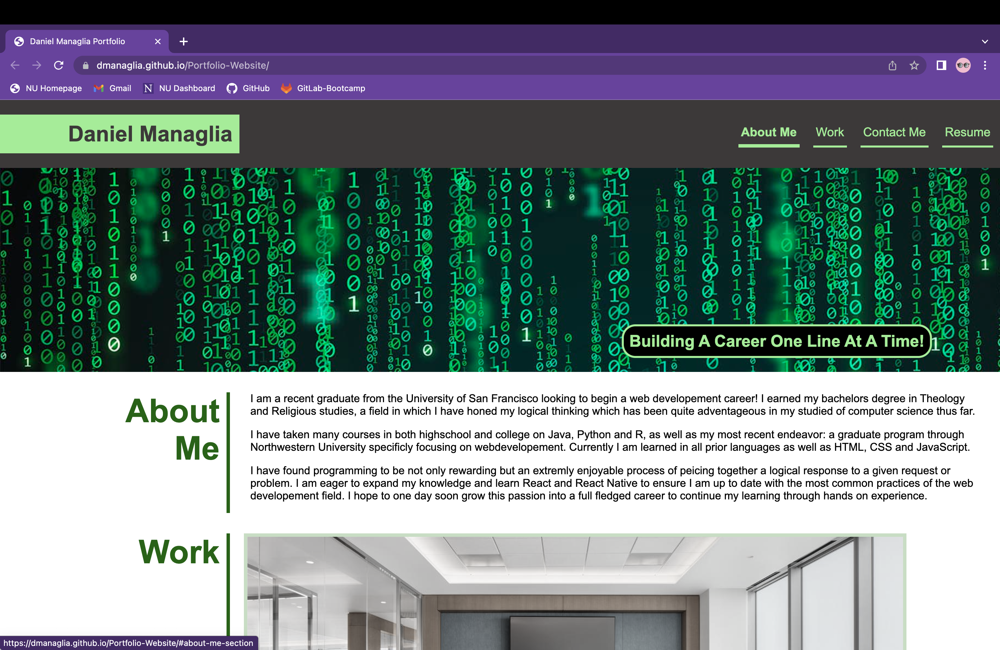
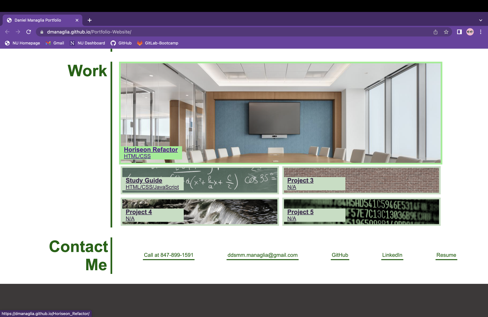
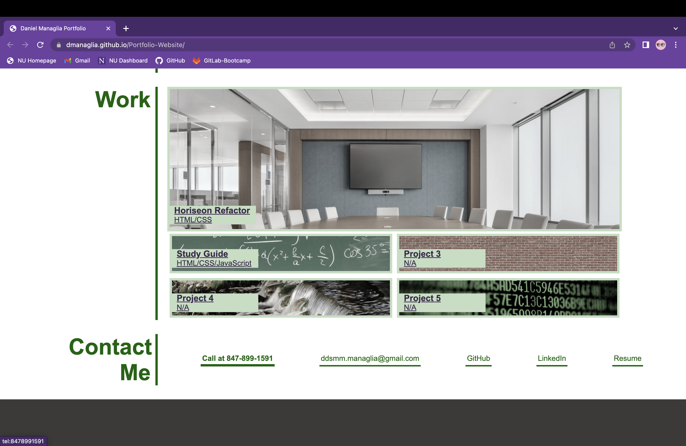
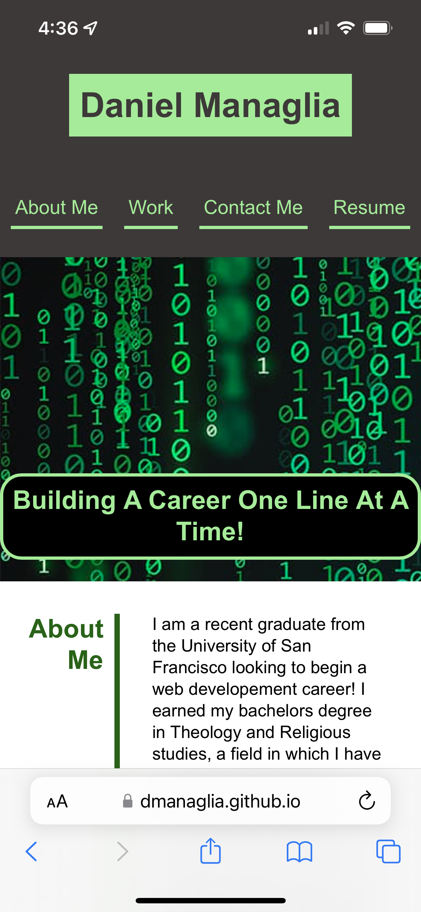

# Porfolio Website

## Description

I sought to improve my outreach to potential employers by not just giving them a sample of my code or information about myself; instead, I created a webpage that does both! The information on the webpage is all about me, my past projects, ways to contact me and a link to my resume. 

The project has helped to consolidate a plethora of scattered information valuable to employers should they want to inspect my work, my prior experience, and ways to contact me.

Not only that but through designing the webpage I have become much more comfortable with the flexbox display and its various applications. If I were to restart this project I would likely make the main section itself flexible to help accomidate changing screen widths which would have saved me a good amount of time and stress. It was a valuable experience that has shown me the benefits of thinking ahead thoroughly to decrease issues that may appear later on such as how the page will look one a tablet or phone.

Overall the webpage is adaptive, it looks clean and it contains many cool feature such as image links, nav links and psuedo classes all of which have helped me put my basic understandings into practice giving me a much stronger grasp on all the content. 

## Installation

No installation necessary just click the link below to view!

[Click here to go to live link](https://dmanaglia.github.io/Portfolio-Website/)

## Usage

In webpage header, hover over any link and the text will become bold and the underline will be bolder (shown below). The first three links will skip to their respective section on the webpage. The resume link opens a new tab to view a pdf copy of my resume.

In the main section of the webpage you will find information about me, my previous work projects and a section with various ways to contact me. In the previous work section you will see that by hovering over any image link the image color will be restored. Clicking on these links directs you to the live link of that project.

In the contact section all links are active including the phone number and email and will also become bold if you hover over them. If you are viewing the page on a phone or mac, you will be able to click on the phone number to call me and leave a message. The same applies for the email; the link will automatically pull a new email draft addressed to my email. The GitHub and LinkedIn links will direct you to my profile on those website and lastly the resume is yet another link to view my resume as a pdf. 

Webpage adjusts spacing and sizing of perticular elements to ensure it looks good on any screen width.

## Credits

Reset css file copied from [Meyerweb.com](https://meyerweb.com/eric/tools/css/reset/)

## License

Please refer to the LICENSE in the repo.

